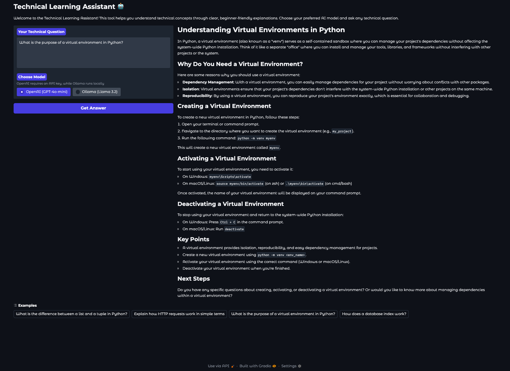

# Technical Learning Assistant 🤖

An interactive AI assistant that helps you learn technical concepts through clear, beginner-friendly explanations. The assistant uses both OpenAI's GPT-4o-mini and Ollama's Llama 3.2 models to provide comprehensive answers to your technical questions.



## Features

- 🤔 Ask any technical question and get clear, step-by-step explanations
- 🎯 Beginner-friendly language with analogies and examples
- 🔄 Choose between OpenAI (GPT-4o-mini) and Ollama (Llama 3.2) models
- 💻 Beautiful web interface built with Gradio
- 📝 Markdown-formatted responses for better readability

## Prerequisites

- Python 3.8 or higher
- OpenAI API key (for GPT-4o-mini)
- Ollama installed locally (for Llama 3.2)

## Installation

1. Clone this repository:
```bash
git clone <repository-url>
cd <repository-name>
```

2. Install the required dependencies:
```bash
pip install -r requirements.txt
```

3. Create a `.env` file in the project root and add your OpenAI API key:
```
OPENAI_API_KEY=your-api-key-here
```

4. Install Ollama (if you want to use the local model):
   - Follow the instructions at [Ollama's official website](https://ollama.ai)
   - Pull the Llama 3.2 model:
   ```bash
   ollama pull llama2
   ```

## Usage

1. Run the technical assistant:
```bash
python app.py
```

2. Open your web browser and navigate to the URL shown in the terminal (usually http://localhost:7860)

3. Choose your preferred model:
   - **OpenAI (GPT-4o-mini)**: Cloud-based, more powerful but requires API key
   - **Ollama (Llama 3.2)**: Local model, works offline but may be less powerful

4. Enter your technical question and click "Get Answer"

## Tips for Best Results

1. Be specific in your questions
2. Ask for examples if needed
3. Request clarification if the answer isn't clear
4. Try both models to compare responses

## Contributing

Feel free to submit issues and enhancement requests!

## License

This project is licensed under the MIT License - see the LICENSE file for details. 